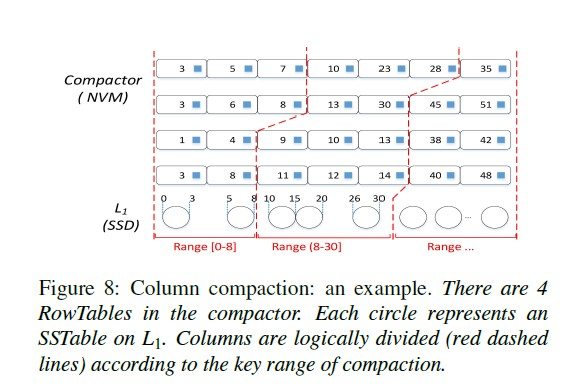

#### Matrix Container

**NVM 空间预分配—— NvmCfModule (管理每个 matrix container)**

> ptr_sst : nvm 空间管理 （BitMap）
>
> sst_meta :  记录 RowTable 信息 (内存中)

```cpp
// nvm_cf_mod.cc
NvmCfModule::NvmCfModule(NvmCfOptions* nvmcfoption, const std::string& cf_name,
                         uint32_t cf_id, const InternalKeyComparator* icmp) 
: nvmcfoption_(nvmcfoption), icmp_(icmp), cf_name_(cf_name), cf_id_(cf_id) {
  // buffer size: 64M
  // stop_size: 8192M
  // table_num: 258
  // column compaction trigger size 通常比 stop size 略小
  uint64_t level0_table_num = (nvmcfoption_->Level0_column_compaction_stop_size / nvmcfoption_->write_buffer_size + 1)*2;
    
  // ptr_sst: 管理 nvm 空间分配/释放
    ptr_sst_ = new PersistentSstable(
      nvm_path,
      nvmcfoption_->write_buffer_size + 8ul * 1024 * 1024,
      // RowTable Size = buffer size + meta size
      level0_table_num);
  // sst_meta: 用于管理所有 RowTable (Matrix Container)
  sst_meta_ = new SstableMetadata(icmp_, nvmcfoption_);
}

// ptr_sst (物理上)
class PersistentSstable {
  char* raw_;           // Matrix Container 起始地址
  BitMap* bitmap_;      // 管理 RowTable 使用情况
  uint64_t total_size_; // Matrix Container 总大小
  uint64_t each_size_;  // 每个 RowTable 大小
  uint64_t num_;        // Matrix Container 中 RowTable 个数
  uint64_t use_num_;    // 已使用的 RowTable 数量
};

// sst_meta (逻辑上)
class SstableMetadata {
private:
  std::vector<FileEntry*> files_;   // RowTables in MatrixContainer
  const InternalKeyComparator* icmp_;
  const NvmCfOptions* nvmcfoption_;
};
```
> 预分配整个 Matrix Container 空间
>
> each_size：每个 RowTable 大小
>
> number：Matrix Container 中 RowTable 个数

```cpp
// persistent_sstable.h
PersistentSstable(std::string &path, uint64_t each_size, uint64_t number) {
    uint64_t total_size = each_size * number;
    // libpmem API
    pmemaddr = pmem_map_file(path.c_str(), total_size,
                                      PMEM_FILE_CREATE, 0666,
                                      &mapped_len, &is_pmem);
    assert(pmemaddr != nullptr);
    raw_ = pmemaddr;
    num_ = number;
    bitmap_ = new BitMap(number);
    // ...
}
```


**RowTable Add 操作**

> 1. NVM 中“分配” RowTable 空间 ( 已经预分配，仅使用 BitMap 标识)
> 2. sst_meta_ 记录 RowTable 信息 ( **FileEntry 形式**)

```cpp
// nvm_cf_mod.cc
bool NvmCfModule::AddL0TableRoom(uint64_t filenum, char** raw,
                    FileEntry** file) {
  // 1.
  int index = -1;
  char* tmp = nullptr;
  tmp = ptr_sst_->AllocSstable(index);  // 返回 index 用于空间释放 (保存在 sst_meta)
  *raw = tmp;
  FileEntry* filetmp = nullptr;
    
  // 2.
  filetmp = sst_meta_->AddFile(filenum, index);	// filenum, 用于 sst_meta 中定位 FileEntry
  if (filetmp != nullptr) {
    *file = filetmp;
  }
  return true;
}
```

> 1. 实际空间已经预分配 (matrix container)，仅使用 bitmap 标识
>
> 2. 根据 FileEntry->index 可以定位该 RowTable 对应的 NVM 地址

```cpp
// persistent_sstable.h
char* AllocSstable(int& index) {
    char* alloc = nullptr;
    for(int i = 0; i < num_; i++) {
        if(bitmap_->get(i) == 0) {				// bitMap
            index = (int)i;
            alloc = raw_ + index * each_size_;	// 2. 直接使用 index 计算 nvm 地址
            bitmap_->set(index);				// 1.
            return alloc;
        }
    }
    return alloc;
}
// address in nvm
char* GetIndexPtr(int index) {
    assert((uint64_t)index < num_ && index >= 0);
    return raw_ + index * each_size_;
}
```


**RowTable Delete 操作**

> 1. NVM 中的 RowTable 定位
>    1. 利用 filenumber 在 sst_meta_ 中找出 FileEntry
>    2. 根据 FileEntry->sstable_index 定位 RowTable
> 2. 取消 Matrix Container 中 RowTable 的占位符 (BitMap)，用于回收使用 RowTable 空间
> 3. sst_meta_ 中移除该 RowTable 信息 (FileEntry)

```cpp
// nvm_cf_mod.cc
void NvmCfModule::DeleteL0file(uint64_t filenumber) {
  FileEntry* tmp = sst_meta_->FindFile(filenumber);// 1.1 根据 filenumber 定位 FileEntry
  if(tmp == nullptr) return;
  ptr_sst_->DeleteSstable(tmp->sstable_index);	 // 1.2, 2., 3. 
  sst_meta_->DeteleFile(filenumber);			 // 4. delete FileEntry
}
```


**NVM (Matrix Container) 空间释放**

> 真正释放 NVM 空间

```cpp
// nvm_cf_mod.cc
NvmCfModule::~NvmCfModule() {
  delete ptr_sst_;
  delete sst_meta_;
}

// persistent_sstable.h
~PersistentSstable() {
    delete bitmap_;
    pmem_unmap(raw_, mapped_len_);	// libpmem API
}
```


```cpp
// 描述每个 RowTable 信息(sstable_meta.h)
struct FileEntry {
    uint64_t filenum;  // index
    int sstable_index; // RowTable 的 index; (用于计算 nvm 地址)
    struct KeysMetadata* keys_meta = nullptr; // ordered by key; 有序
    uint64_t keys_num;
    uint64_t key_point_filenum; // key 指向下一个文件的filenum, 防止中间删除了文件 (遍历校验)
};

// 描述每个 Metadata 信息 (sstable_meta.h)
struct KeysMetadata {
  InternalKey key;
  int32_t next;     // *前向指针, 用于 cross-row hint search*
  uint64_t offset;  // kv's offset (kv 相对于当前 RowTable 起始地址的偏移)
  uint64_t size;    // kv's size (key + 8 + value + 8)
};
```


#### RowTable 中的 KV Add 操作及 RowTable 持久化

**Key Value 结构**

```shell
 * ------------
 * | key_size | // 8 byte
 * ------------
 * |    key   |
 * ------------
 * |value_size| // 8 byte
 * ------------
 * |   value  |
 * ------------
```


**Add (key_value => 内存 buf_)**

> 1. 组建上述 key_value 结构
> 2. key_value 加入 buf_
> 3. 记录 kv 的 metadata

```cpp
// L0_table_builder.cc
void L0TableBuilderWithBuffer::Add(const Slice& key, const Slice& value) {
    uint64_t total_size = key.size_ + value.size_ + 8 + 8;
    
    // 1. key_value
    std::string key_value;
    PutFixed64(&key_value, key.size_);
    key_value.append(key.data_, key.size_);
    PutFixed64(&key_value, value.size_);
    key_value.append(value.data_, value.size_);

    // 2. key_value to buf_
    memcpy(buf_ + offset_, key_value.c_str(), total_size);

    // 3. record metadata
    KeysMetadata *tmp = new KeysMetadata();
    tmp->offset = offset_;
    tmp->size = total_size;
    tmp->key.DecodeFrom(key);
    
    keys_.push_back(tmp);
    keys_num_++;
    offset_ += total_size;
}
```


**RowTable 持久化 ——Finish (内存 buf_ => NVM)**

> 1. 更新 RowTable 元数据 FileEntry 结构
> 2. 更新前向指针;  将 metadata 加入 buf_
> 3. buf_ 持久化到 NVM (pmem API)

```cpp
// L0_table_builder.cc
Status L0TableBuilderWithBuffer::Finish() {
    // 1. file_ (FileEntry 类型)
    file_->keys_num = keys_num_;
    file_->keys_meta = new KeysMetadata[keys_num_];
    int index =0;
    for(auto key_ : keys_) {
        file_->keys_meta[index].key = key_->key;
        file_->keys_meta[index].offset = key_->offset;
        file_->keys_meta[index].size = key_->size;
        index++;
    }
    // 2. for Cross-Row Hint Search
    //	 1. 遍历当前以及下一个 FileEntry 的 Metadata
    //	 2. 更新 Metadata.next
    nvm_cf_->UpdateKeyNext(file_);		// (后)

    // 2. append metadatas
    std::string metadatas;
    for(int i = 0; i < file_->keys_num; i++) {
        Slice key = file_->keys_meta[i].key.Encode();
        PutFixed64(&metadatas,key.size());
        metadatas.append(key.data(), key.size());
        PutFixed32(&metadatas,file_->keys_meta[i].next);
        PutFixed64(&metadatas,file_->keys_meta[i].offset);
        PutFixed64(&metadatas,file_->keys_meta[i].size);
    }
    if((offset_ + metadatas.size()) > max_size_) {
      return Status::IOError();	// [Error 1]
    }
    keys_meta_size_ = metadatas.size();
    // 2. write meta data to buf_
    memcpy(buf_ + offset_, metadatas.c_str(), metadatas.size());

    // 3. write buf_ to NVM
    pmem_memcpy_persist(raw_ , buf_, offset_ + keys_meta_size_);  // libpmem API
    return Status();
}
```


#### Column Compaction



**Column Compaction 选取过程 (与 L1 有交集的情况下)**

> L1Ranges: (0, 3, 5, 8, ..., 30)
>
> 1. 选取 RowTables 中的待处理的最小 key：key_current
> 2. 根据 key_current 大小，尝试扩大 L1 Range,  直到 L1 Range 包含 key_current
> 3. 不断从 RowTables 中处理最小 key，直到达到 column compaction 阈值
> 4. 达到 column compaction 触发阈值，根据 L1 Range，记录需要 Merge 的 L1 Sstable
> 5. 核心: "不断加入 RowTable 的 key 来扩大 L1 Range，直到达到 compaction 阈值"

```cpp
// nvm_cf_mod.cc
// 获取 L1 Range (f1.smallest, f1.largest, f2.smallest, f2.largest...)
std::vector<InternalKey> L1Ranges;
for(int i = 0; i < L1overlapfiles.size(); i++) {	// 与 L0 有交集的 L1
  L1Ranges.emplace_back(L1overlapfiles.at(i)->smallest);
  L1Ranges.emplace_back(L1overlapfiles.at(i)->largest);
}
// level-1 的 key range 下标
int L1Range_index = 0;
InternalKey key_current;

// 1. k_iter: 指向 L0 中最小 key
while(k_iter->Valid()) {
  k_iter->GetCurret(files_index, keys_index);
  key_current = comfiles[files_index->keys_meta[keys_index].key;
  // Level-1: [0,3] [5,8] [10,15] ... [left,right]
  // 对于 current_key, 扩大 L1Range_index, 直到
  // (1) current_key < L1Ranges[L1Range_index] (当前扩展到 left)
  //	 边界情况举例: current_key = 5, L1Range_index = 2 时需要继续扩展 L1(sstable"完整性")
  // (2) current_key <= L1Ranges[L1Range_index] (当前扩展到 right)
  //	 边界情况举例: current_key = 8, L1Range_index = 3 时不需要再扩展 L1(已满足sst"完整性")
  // 核心: 添加 sstable, 直到满足:
  //	1. 与 sstable key range 有交集的 L0'keys 都必须包含在里面
  //    2. 所有包含在内的 L0'keys 达到 compaction 阈值
  if( (L1Range_index%2 == 0 && Compare(key_current, L1Ranges[L1Range_index]) >= 0) ||
        (L1Range_index%2 == 1 && Compare(key_current, L1Ranges[L1Range_index]) > 0) )
{
    if(L1Range_index%2 == 1 && all_comption_size >= L1HaveCompactionSizeStop) {
      // 4. (current_key > L1Ranges[L1Range_index] 且达到阈值, 不需要再添加 current_key)
      //	例: current_key = 9, L1Range_index = 3; current_key 不需要在加入
      break;
    }
    L1Range_index++;// 2. expand Level-1 range
    continue;
  }
  itemsize = comfiles[files_index]->keys_meta[keys_index].size;
  keys_num[files_index]++;
  keys_size[files_index] += itemsize;
  all_comption_size += itemsize;
  // 4. 达到触发条件 (left 且 current_key < L1Ranges[L1Range_index])
  // 	例: current_key = 4, L1Range_index = 2
  if(L1Range_index % 2 == 0 && all_comption_size >= L1HaveCompactionSizeStop) {
      break;
  }
  k_iter->Next();
}
// 4. 根据得到的 L1Range_index, 获取 L1 中需要参与 Column Compaction 的 Sstable
for(int i = 0; i < ((L1Range_index + 1)/2); i++) {
    c->L1compactionfiles.push_back(L1overlapfiles[i]);
}
```

> 另外:  如果 L0 与 L1 无交集，则不断加入 RowTable 中的当前最小 key，直到达到 compaction 阈值。


#### Cross-Row hint search


**前向指针 next 的构建过程 （RowTable finish 时）**

> 1. 找到当前 FileEntry 的下一个 FileEntry
> 2. 遍历两个 FileEntry，更新当前 FileEntry->keys_meta 元素的 next 指针

```cpp
// sstable_meta.cc
void SstableMetadata::UpdateKeyNext(FileEntry* file) {
    if(file == nullptr || file->keys_num == 0) {
        return ;
    }
    // 1. 
    std::vector<FileEntry*>::iterator it = files_.begin();
    for(; it != files_.end(); it++) {
        if((*it)->filenum == file->filenum) {
            it++;
            break;
        }
    }
    FileEntry* next_file = (*it);
    struct KeysMetadata* new_keys = file->keys_meta;		// current FileEntry
    struct KeysMetadata* old_keys = next_file->keys_meta;	// next FileEntry
    uint64_t new_key_num = file->keys_num, old_key_num = next_file->keys_num;
    int32_t new_index = 0, old_index = 0;
    // 2.
    while((uint64_t)new_index < new_key_num && (uint64_t)old_index < old_key_num) {
        // old_key >= new_key (有序)
        if(icmp_->Compare(old_keys[old_index].key, new_keys[new_index].key) >= 0) {
            new_keys[new_index].next = old_index;
            new_index++;
        }
        else {	// old_key < new_key
            old_index++;
        }
    }
    file->key_point_filenum = next_file->filenum;// 相当于 point,链接下一个 RowTable(防删除)
}
```


**查询过程 NvmCfModule::Get**

> 1. 根据 sst_meta_，获取所有 RowTable 信息 (包含 RowTable 的 meta 信息)
> 2. 执行 Cross-Row Hint Search
> 3. 比较 lkey 是否在当前 RowTable 的 Key Range 内（根据 meta data）
>    1. 范围内：利用 meta data 执行 Binary Search，查找目标 key （没找到的话，利用前向指针 next 更新下标 (缩小范围)，继续在下一个 RowTable 中查找）
>    2. 小于：利用前向指针 next，缩小搜索范围，在下一个 RowTable 中继续查找
>    3. 大于：利用前向指针 next，缩小搜索范围，在下一个 RowTable 中继续查找

```cpp
// nvm_cf_mod.cc
bool NvmCfModule::Get(VersionStorageInfo* vstorage, Status *s, const LookupKey &lkey, std::string *value) {
  // 1
  auto L0files = vstorage->LevelFiles(0);	// FileMetaData
  std::vector<FileEntry*> findfiles;
  std::vector<uint64_t> first_key_indexs;   // RowTable 中已经 Column Compaction的 key下标
  sst_meta_->GetL0Files(L0files, findfiles);// 获取 L0 FileEntrys
  for(int i = 0; i < L0files.size(); i++) {
    // first_key_index: RowTable 中未 column compaction 的第一个 key index
    first_key_indexs.push_back(L0files.at(i)->first_key_index);
  }
  
  Slice user_key = lkey.user_key();
  int find_index = -1, pre_left = -1, pre_right = -1;
  uint64_t next_file_num = 0;
  // 2  (sst_meta_: FileEntry 在头部 insert)
  for(int i = 0; i < findfiles.size(); i++) {
    file = findfiles.at(i);
    if(next_file_num != file->filenum) {
      pre_left = -1;
      pre_right = -1;
    }
	// 3
    int com_result = UserKeyCompareRange(&user_key, &(file->keys_meta[first_key_indexs[i]].key), &(file->keys_meta[file->keys_num - 1].key));
    // 3.1
    if( com_result == 0) {
      if(BinarySearchInFile(file, first_key_indexs[i], &user_key, &find_index, &pre_left, &pre_right)) {
        GetValueInFile(file, find_index, value);
        *s = Status::OK();
        return true;
      }
      // 第一次: pre_left: 图中 10, pre_right: 图中 23
      // 更新 left 为 next 指向的下一个 rowtable 中 key 的前一个 (图中 10 => 8)
      if(pre_left >= (int)first_key_indexs[i] && pre_left < (int)file->keys_num) {
        pre_left = (int)file->keys_meta[pre_left].next - 1;
      }
      // 更新 right 为 next 指向的下一个 rowtable 中的 key (图中 23 => 30)
      if(pre_right >= (int)first_key_indexs[i] && pre_right < (int)file->keys_num) {
        pre_right = (int)file->keys_meta[pre_right].next;
      }
      next_file_num = file->key_point_filenum; // 相当于 point,链接下一个 RowTable (防删除)
    }
    // 3.2  user_key < [first_key, last_key]
    else if(com_result < 0) {
      pre_left = -1;
      pre_right = (int)file->keys_meta[first_key_indexs[i]].next;
      next_file_num = file->key_point_filenum;
    }
    // 3.3  user_key > [first_key, last_key]
    else {
      pre_left = (int)file->keys_meta[file->keys_num - 1].next - 1;
      pre_right = -1;
      next_file_num = file->key_point_filenum;
    }
  }
  return false;
}
```

