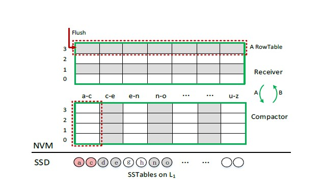

#### MatrixKV如何利用NVM的，把那些数据放在了NVM


MatrixKV 使用了如图所示的三级架构

1. 以 **MemTables** 的形式批量写入 DRAM 
2. DRAM 的 **MemTables** Flush 到 NVM (Matrix Container)
3. NVM 的数据，经过 **细粒度** 的列压缩之后，再存入 SSD


MatrixKV 提出了 Matrix Container 的概念，而 Matrix Container 实际上是作者对 **NVM 的一种 组织/使用 形式**。

Matrix Container 整体结构示意图：



Matrix Container (NVM) 在 MatrixKV 中的作用/价值：

- 以 **Row Tables** (后面介绍) 的形式组织 LSM-tree 的 **L0 层** 数据。从 **DRAM** flush 进来的 **MemTables** 将会以 **Row Tables** 的形式进行组织，而一个 **MemTable** 对应一个 **Row Table**

- 在 Matrix Container 对其里面的数据（即 L0层），进行 **细粒度** 的压缩 （这将有效减少 **写停顿**的发生）。然后将压缩后的数据 （ L1 层）写入 SSD 中，L1 层及往下则与 RocksDB 一样。压缩示意图：

  

- **Row Tables** 特有的组织形式，也将在一定程度上加快 搜索过程（Cross-row Hint Search）


**Row Tables**

Row Table 与 一般的 SSTable 对比示意图


Row Table 的一个 元数据（metadata）由如下部分组成：

- k0，即 kv 对所对应的 key。并且一个 Row Table 里面的元数据，都**按照 key 的大小有序**排列。

- 页号(page number) 以及 页偏移 (offset)。 NVM 以分页的形式进行管理，支持字节寻址和随机访问。
- P0，向前指针（用于 Cross Hint Search）

**关于 Cross Hint Search**

一个查询示意图：


一个 Row Table 中的元数据按照 key 的大小有序排列，每个元数据内部都有一个**向前指针：指向下一个 Row Table** 中 大于等于它自己的 元数据。因此，通过使用向前指针，在一定程度上会加快查询速度。


#### 2. MatrixKV使用NVM的方式，是当成DRAM用，还是当成存储

通过上面的分析，MatrixKV 将 LSM-tree 的 L0 放在 Matrix Container(NVM)中，是将 NVM 当成存储用。


#### 3. MatrixKV本身提供的benchmark工具，在我们实验环境的验证结果。这一点争取有多个数据集的规模，数据集太小说服力不强

默认配置为：

```
读: 800w
写: 800w
value_size: 4k
并发线程数: 1
wal
max_bytes_for_level_base: 256M
# max_bytes_for_level_base 为 L1 层的默认大小，往后第 L 层(L >= 2)的大小为:
#     (max_bytes_for_level_base) * (max_bytes_for_level_multiplier ^ (L-1))
# 	  max_bytes_for_level_multiplier: 默认为 10
```


**以下从不同维度更改配置，进行数据对比**


**1. 数据集大小**

<div className="table-container">
<table>
    <tr>
        <td></td>
        <td></td>
        <td  colspan="18">随机写</td>
        <td  colspan="18">顺序读</td>
        <td  colspan="18">随机读</td>
   </tr>
    <tr>
        <td></td>
        <td>结果数据类型</td>
        <td colspan="3">ops/sec</td>
        <td colspan="3">Speed(MB/s)</td>
        <td colspan="3">Average Latency</td>
        <td colspan="3">P50</td>
        <td colspan="3">P99</td>
        <td colspan="3">P999</td>
        <td colspan="3">ops/sec</td>
        <td colspan="3">Speed(MB/s)</td>
        <td colspan="3">Average Latency</td>
        <td colspan="3">P50</td>
        <td colspan="3">P99</td>
        <td colspan="3">P999</td>
        <td colspan="3">ops/sec</td>
        <td colspan="3">Speed(MB/s)</td>
        <td colspan="3">Average Latency</td>
        <td colspan="3">P50</td>
        <td colspan="3">P99</td>
        <td colspan="3">P999</td>
    </tr>
    <tr>
        <td></td>
        <td>测试类型</td>
        <td>MatrixKV</td>
        <td>RocksDB</td>
        <td>提升 %</td>
        <td>MatrixKV</td>
        <td>RocksDB</td>
        <td>提升 %</td>
        <td>MatrixKV</td>
        <td>RocksDB</td>
        <td>下降 %</td>
        <td>MatrixKV</td>
        <td>RocksDB</td>
        <td>下降 %</td>
        <td>MatrixKV</td>
        <td>RocksDB</td>
        <td>下降 %</td>
        <td>MatrixKV</td>
        <td>RocksDB</td>
        <td>下降 %</td>
        <td>MatrixKV</td>
        <td>RocksDB</td>
        <td>提升 %</td>
        <td>MatrixKV</td>
        <td>RocksDB</td>
        <td>提升 %</td>
        <td>MatrixKV</td>
        <td>RocksDB</td>
        <td>下降 %</td>
        <td>MatrixKV</td>
        <td>RocksDB</td>
        <td>下降 %</td>
        <td>MatrixKV</td>
        <td>RocksDB</td>
        <td>下降 %</td>
        <td>MatrixKV</td>
        <td>RocksDB</td>
        <td>下降 %</td>
        <td>MatrixKV</td>
        <td>RocksDB</td>
        <td>提升 %</td>
        <td>MatrixKV</td>
        <td>RocksDB</td>
        <td>提升 %</td>
        <td>MatrixKV</td>
        <td>RocksDB</td>
        <td>下降 %</td>
        <td>MatrixKV</td>
        <td>RocksDB</td>
        <td>下降 %</td>
        <td>MatrixKV</td>
        <td>RocksDB</td>
        <td>下降 %</td>
        <td>MatrixKV</td>
        <td>RocksDB</td>
        <td>下降 %</td>
    </tr>
    <tr>
        <td>数据集大小</td>
    	<td>200w</td>
        <td>66523</td>
        <td>34200</td>
        <td>94.51</td>
        <td>260.9</td>
        <td>134.1</td>
        <td>94.56</td>
        <td>15.03</td>
        <td>29.23</td>
        <td>48.58</td>
        <td>13.45</td>
        <td>8.27</td>
        <td>-62.64</td>
        <td>21.97</td>
        <td>14.98</td>
        <td>-46.66</td>
        <td>33.01</td>
        <td>1180.09</td>
        <td>97.20</td>
        <td>355384</td>
        <td>357141</td>
        <td>-0.49</td>
        <td>1393.6</td>
        <td>1400.5</td>
        <td>-0.49</td>
        <td>2.8139</td>
        <td>2.8</td>
        <td>-0.50</td>
        <td>2.26</td>
        <td>2.31</td>
        <td>2.16</td>
        <td>5.72</td>
        <td>5.22</td>
        <td>-9.58</td>
        <td>8.98</td>
        <td>7.59</td>
        <td>-18.31</td>
        <td>110067</td>
        <td>120845</td>
        <td>-8.92</td>
        <td>431.6</td>
        <td>473.9</td>
        <td>-8.93</td>
        <td>2.81</td>
        <td>8.27</td>
        <td>66.02</td>
        <td>8.67</td>
        <td>8.14</td>
        <td>-6.51</td>
        <td>14.91</td>
        <td>14.83</td>
        <td>-0.54</td>
        <td>25.38</td>
        <td>20.39</td>
        <td>-24.47</td>
    </tr>
    <tr>
        <td>数据集大小</td>
    	<td>800w</td>
        <td>48880</td>
        <td>25043</td>
        <td>95.18</td>
        <td>191.7</td>
        <td>98.2</td>
        <td>95.21</td>
        <td>20.45</td>
        <td>39.93</td>
        <td>48.79</td>
        <td>13.45</td>
        <td>8.62</td>
        <td>-56.03</td>
        <td>26.53</td>
        <td>967.16</td>
        <td>97.26</td>
        <td>1161.92</td>
        <td>1269.04</td>
        <td>8.44</td>
        <td>353397</td>
        <td>327204</td>
        <td>8.01</td>
        <td>1385.9</td>
        <td>1283.1</td>
        <td>8.01</td>
        <td>2.8</td>
        <td>3.05</td>
        <td>8.20</td>
        <td>2.30</td>
        <td>2.45</td>
        <td>6.12</td>
        <td>5.62</td>
        <td>5.95</td>
        <td>5.55</td>
        <td>7.95</td>
        <td>9.71</td>
        <td>18.13</td>
        <td>131123</td>
        <td>106156</td>
        <td>23.52</td>
        <td>514.2</td>
        <td>416.3</td>
        <td>23.52</td>
        <td>7.6</td>
        <td>9.42</td>
        <td>19.32</td>
        <td>7.79</td>
        <td>9.11</td>
        <td>14.49</td>
        <td>14.63</td>
        <td>14.98</td>
        <td>2.34</td>
        <td>18.65</td>
        <td>21.51</td>
        <td>13.30</td>
    </tr>
    <tr>
        <td>数据集大小</td>
    	<td>1600w</td>
        <td>34514</td>
        <td>15612</td>
        <td>121.07</td>
        <td>135.3</td>
        <td>61.2</td>
        <td>121.08</td>
        <td>28.97</td>
        <td>64.05</td>
        <td>54.77</td>
        <td>13.29</td>
        <td>8.18</td>
        <td>-62.47</td>
        <td>907.22</td>
        <td>1157.33</td>
        <td>21.61</td>
        <td>1263.93</td>
        <td>1287.68</td>
        <td>1.84</td>
        <td>363266</td>
        <td>354608</td>
        <td>2.44</td>
        <td>1424.6</td>
        <td>1390.6</td>
        <td>2.44</td>
        <td>2.75</td>
        <td>2.82</td>
        <td>2.48</td>
        <td>2.26</td>
        <td>2.30</td>
        <td>1.74</td>
        <td>5.08</td>
        <td>5.54</td>
        <td>8.30</td>
        <td>6.23</td>
        <td>8.14</td>
        <td>23.46</td>
        <td>121567</td>
        <td>91887</td>
        <td>32.30</td>
        <td>476.7</td>
        <td>360.3</td>
        <td>32.31</td>
        <td>8.22</td>
        <td>10.88</td>
        <td>24.45</td>
        <td>8.24</td>
        <td>10.48</td>
        <td>21.37</td>
        <td>14.75</td>
        <td>20.48</td>
        <td>27.98</td>
        <td>20.56</td>
        <td>23.97</td>
        <td>14.23</td>
    </tr>
    <tr>
        <td>数据集大小</td>
    	<td>3200w</td>
        <td>22555</td>
        <td>8320</td>
        <td>171.09</td>
        <td>88.5</td>
        <td>32.6</td>
        <td>171.47</td>
        <td>44.33</td>
        <td>120.18</td>
        <td>63.11</td>
        <td>13.50</td>
        <td>8.28</td>
        <td>-63.04</td>
        <td>1128.52</td>
        <td>1236.14</td>
        <td>8.71</td>
        <td>1284.66</td>
        <td>1295.67</td>
        <td>0.85</td>
        <td>365356</td>
        <td>345066</td>
        <td>5.88</td>
        <td>1432.7</td>
        <td>1353.2</td>
        <td>5.87</td>
        <td>2.73</td>
        <td>2.89</td>
        <td>5.54</td>
        <td>2.27</td>
        <td>2.35</td>
        <td>3.40</td>
        <td>4.25</td>
        <td>5.75</td>
        <td>26.09</td>
        <td>6.28</td>
        <td>9.24</td>
        <td>32.03</td>
        <td>115586</td>
        <td>66989</td>
        <td>72.54</td>
        <td>453.3</td>
        <td>262.7</td>
        <td>72.55</td>
        <td>8.65</td>
        <td>14.92</td>
        <td>42.02</td>
        <td>8.16</td>
        <td>13.88</td>
        <td>41.21</td>
        <td>14.56</td>
        <td>31.86</td>
        <td>54.30</td>
        <td>20.39</td>
        <td>33.82</td>
        <td>39.71</td>
    </tr>
    <tr>
    	<td>数据集大小</td>
        <td>6400w</td>
        <td>16036</td>
        <td>6346</td>
        <td>152.69</td>
        <td>62.9</td>
        <td>24.9</td>
        <td>152.61</td>
        <td>62.35</td>
        <td>157.57</td>
        <td>60.43</td>
        <td>13.64</td>
        <td>8.54</td>
        <td>-59.72</td>
        <td>1198.19</td>
        <td>1254.99</td>
        <td>4.53</td>
        <td>1291.35</td>
        <td>1298.16</td>
        <td>0.52</td>
        <td>350250</td>
        <td>299151</td>
        <td>17.08</td>
        <td>1373.5</td>
        <td>1173.1</td>
        <td>17.08</td>
        <td>2.85</td>
        <td>3.34</td>
        <td>14.67</td>
        <td>2.38</td>
        <td>2.53</td>
        <td>5.93</td>
        <td>4.14</td>
        <td>8.29</td>
        <td>50.06</td>
        <td>7.00</td>
        <td>43.22</td>
        <td>83.80</td>
        <td>99204</td>
        <td>52918</td>
        <td>87.47</td>
        <td>389.0</td>
        <td>207.5</td>
        <td>87.47</td>
        <td>10.08</td>
        <td>18.89</td>
        <td>46.64</td>
        <td>8.58</td>
        <td>18.29</td>
        <td>53.09</td>
        <td>20.49</td>
        <td>33.60</td>
        <td>39.02</td>
        <td>21.90</td>
        <td>39.43</td>
        <td>44.46</td>
    </tr>
</table>
</div>


**2. value_size 大小**

<table>
    <tr>
        <td></td>
        <td></td>
        <td  colspan="18">随机写</td>
        <td  colspan="18">顺序读</td>
        <td  colspan="18">随机读</td>
   </tr>
    <tr>
        <td></td>
        <td>结果数据类型</td>
        <td colspan="3">ops/sec</td>
        <td colspan="3">Speed(MB/s)</td>
        <td colspan="3">Average Latency</td>
        <td colspan="3">P50</td>
        <td colspan="3">P99</td>
        <td colspan="3">P999</td>
        <td colspan="3">ops/sec</td>
        <td colspan="3">Speed(MB/s)</td>
        <td colspan="3">Average Latency</td>
        <td colspan="3">P50</td>
        <td colspan="3">P99</td>
        <td colspan="3">P999</td>
        <td colspan="3">ops/sec</td>
        <td colspan="3">Speed(MB/s)</td>
        <td colspan="3">Average Latency</td>
        <td colspan="3">P50</td>
        <td colspan="3">P99</td>
        <td colspan="3">P999</td>
    </tr>
    <tr>
        <td></td>
        <td>测试类型</td>
        <td>MatrixKV</td>
        <td>RocksDB</td>
        <td>提升 %</td>
        <td>MatrixKV</td>
        <td>RocksDB</td>
        <td>提升 %</td>
        <td>MatrixKV</td>
        <td>RocksDB</td>
        <td>下降 %</td>
        <td>MatrixKV</td>
        <td>RocksDB</td>
        <td>下降 %</td>
        <td>MatrixKV</td>
        <td>RocksDB</td>
        <td>下降 %</td>
        <td>MatrixKV</td>
        <td>RocksDB</td>
        <td>下降 %</td>
        <td>MatrixKV</td>
        <td>RocksDB</td>
        <td>提升 %</td>
        <td>MatrixKV</td>
        <td>RocksDB</td>
        <td>提升 %</td>
        <td>MatrixKV</td>
        <td>RocksDB</td>
        <td>下降 %</td>
        <td>MatrixKV</td>
        <td>RocksDB</td>
        <td>下降 %</td>
        <td>MatrixKV</td>
        <td>RocksDB</td>
        <td>下降 %</td>
        <td>MatrixKV</td>
        <td>RocksDB</td>
        <td>下降 %</td>
        <td>MatrixKV</td>
        <td>RocksDB</td>
        <td>提升 %</td>
        <td>MatrixKV</td>
        <td>RocksDB</td>
        <td>提升 %</td>
        <td>MatrixKV</td>
        <td>RocksDB</td>
        <td>下降 %</td>
        <td>MatrixKV</td>
        <td>RocksDB</td>
        <td>下降 %</td>
        <td>MatrixKV</td>
        <td>RocksDB</td>
        <td>下降 %</td>
        <td>MatrixKV</td>
        <td>RocksDB</td>
        <td>下降 %</td>
    </tr>
    <tr>
    	<td>value size(byte)</td>
        <td>256</td>
        <td>106723</td>
        <td>178916</td>
        <td>-40.35</td>
        <td>27.7</td>
        <td>46.4</td>
        <td>-40.30</td>
        <td>9.37</td>
        <td>5.58</td>
        <td>-67.92</td>
        <td>8.31</td>
        <td>4.98</td>
        <td>-66.87</td>
        <td>19.78</td>
        <td>9.81</td>
        <td>-101.63</td>
        <td>21.89</td>
        <td>14.37</td>
        <td>-52.33</td>
        <td>889135</td>
        <td>1807331</td>
        <td>-50.80</td>
        <td>230.6</td>
        <td>468.8</td>
        <td>-50.81</td>
        <td>1.12</td>
        <td>0.55</td>
        <td>-103.64</td>
        <td>0.60</td>
        <td>0.54</td>
        <td>-11.11</td>
        <td>3.48</td>
        <td>2.90</td>
        <td>-20.00</td>
        <td>5.91</td>
        <td>3.95</td>
        <td>-49.62</td>
        <td>100221</td>
        <td>112464</td>
        <td>-10.89</td>
        <td>26.0</td>
        <td>29.2</td>
        <td>-10.96</td>
        <td>9.97</td>
        <td>8.89</td>
        <td>-12.15</td>
        <td>8.90</td>
        <td>8.76</td>
        <td>-1.60</td>
        <td>21.84</td>
        <td>14.86</td>
        <td>-46.97</td>
        <td>45.82</td>
        <td>18.26</td>
        <td>-150.93</td>
    </tr>
    <tr>
        <td>value size(byte)</td>
        <td>512</td>
        <td>110052</td>
        <td>173737</td>
        <td>-36.66</td>
        <td>55.4</td>
        <td>87.5</td>
        <td>-36.69</td>
        <td>9.08</td>
        <td>5.75</td>
        <td>-57.91</td>
        <td>8.25</td>
        <td>5.01</td>
        <td>-64.67</td>
        <td>18.75</td>
        <td>9.83</td>
        <td>-90.74</td>
        <td>21.72</td>
        <td>14.69</td>
        <td>-47.86</td>
        <td>761045</td>
        <td>1514798</td>
        <td>-49.76</td>
        <td>383.2</td>
        <td>762.8</td>
        <td>-49.76</td>
        <td>1.31</td>
        <td>0.66</td>
        <td>-98.48</td>
        <td>0.68</td>
        <td>0.58</td>
        <td>-17.24</td>
        <td>4.33</td>
        <td>2.99</td>
        <td>-44.82</td>
        <td>7.63</td>
        <td>4.00</td>
        <td>-90.75</td>
        <td>70870</td>
        <td>157618</td>
        <td>-55.04</td>
        <td>35.7</td>
        <td>79.4</td>
        <td>-55.04</td>
        <td>14.11</td>
        <td>6.34</td>
        <td>-122.56</td>
        <td>12.34</td>
        <td>5.57</td>
        <td>-121.54</td>
        <td>33.68</td>
        <td>9.93</td>
        <td>-239.17</td>
        <td>70.63</td>
        <td>13.81</td>
        <td>-411.44</td>
    </tr>
    <tr>
    	<td>value size(byte)</td>
        <td>1024</td>
        <td>93106</td>
        <td>121099</td>
        <td>-23.12</td>
        <td>92.3</td>
        <td>120.1</td>
        <td>-23.15</td>
        <td>10.74</td>
        <td>8.25</td>
        <td>-30.18</td>
        <td>8.75</td>
        <td>5.19</td>
        <td>-68.59</td>
        <td>20.51</td>
        <td>9.94</td>
        <td>-106.34</td>
        <td>21.91</td>
        <td>87.15</td>
        <td>74.86</td>
        <td>1007735</td>
        <td>1081980</td>
        <td>-6.86</td>
        <td>999.5</td>
        <td>1073.1</td>
        <td>-6.86</td>
        <td>0.99</td>
        <td>0.92</td>
        <td>-7.61</td>
        <td>0.67</td>
        <td>0.67</td>
        <td>0.00</td>
        <td>3.67</td>
        <td>3.18</td>
        <td>-15.41</td>
        <td>5.82</td>
        <td>3.96</td>
        <td>-46.97</td>
        <td>122008</td>
        <td>160012</td>
        <td>-23.75</td>
        <td>121.0</td>
        <td>158.7</td>
        <td>-23.76</td>
        <td>8.19</td>
        <td>6.24</td>
        <td>-31.25</td>
        <td>8.24</td>
        <td>5.43</td>
        <td>-51.75</td>
        <td>14.82</td>
        <td>9.88</td>
        <td>-50.00</td>
        <td>16.45</td>
        <td>10.00</td>
        <td>-64.50</td>
    </tr>
    <tr>
    	<td>value size(byte)</td>
        <td>4096</td>
        <td>49676</td>
        <td>26215</td>
        <td>89.49</td>
        <td>194.8</td>
        <td>102.8</td>
        <td>89.49</td>
        <td>20.13</td>
        <td>38.14</td>
        <td>47.22</td>
        <td>13.46</td>
        <td>8.12</td>
        <td>-65.76</td>
        <td>27.60</td>
        <td>946.43</td>
        <td>97.08</td>
        <td>1151.15</td>
        <td>1266.99</td>
        <td>9.14</td>
        <td>359878</td>
        <td>342198</td>
        <td>5.17</td>
        <td>1411.3</td>
        <td>1341.9</td>
        <td>5.17</td>
        <td>2.77</td>
        <td>2.92</td>
        <td>5.14</td>
        <td>2.25</td>
        <td>2.37</td>
        <td>5.06</td>
        <td>5.55</td>
        <td>5.73</td>
        <td>3.14</td>
        <td>7.28</td>
        <td>9.06</td>
        <td>19.65</td>
        <td>133235</td>
        <td>105562</td>
        <td>26.21</td>
        <td>522.5</td>
        <td>414.0</td>
        <td>26.21</td>
        <td>7.50</td>
        <td>9.47</td>
        <td>20.80</td>
        <td>7.69</td>
        <td>9.87</td>
        <td>22.09</td>
        <td>14.62</td>
        <td>14.93</td>
        <td>2.08</td>
        <td>19.61</td>
        <td>19.79</td>
        <td>0.91</td>
    </tr>
    <tr>
    	<td>value size(byte)</td>
        <td>8192</td>
        <td>18643</td>
        <td>7999</td>
        <td>133.07</td>
        <td>145.9</td>
        <td>62.6</td>
        <td>133.07</td>
        <td>53.63</td>
        <td>125.00</td>
        <td>57.10</td>
        <td>18.10</td>
        <td>12.58</td>
        <td>-43.88</td>
        <td>1139.37</td>
        <td>1249.80</td>
        <td>8.84</td>
        <td>1286.82</td>
        <td>2787.02</td>
        <td>53.83</td>
        <td>260777</td>
        <td>257865</td>
        <td>1.13</td>
        <td>2041.3</td>
        <td>2018.5</td>
        <td>1.13</td>
        <td>3.83</td>
        <td>3.87</td>
        <td>1.03</td>
        <td>3.32</td>
        <td>3.30</td>
        <td>-0.61</td>
        <td>7.69</td>
        <td>8.92</td>
        <td>13.79</td>
        <td>9.82</td>
        <td>9.94</td>
        <td>1.21</td>
        <td>108066</td>
        <td>68874</td>
        <td>56.90</td>
        <td>845.9</td>
        <td>539.1</td>
        <td>56.90</td>
        <td>9.25</td>
        <td>14.5</td>
        <td>36.21</td>
        <td>8.43</td>
        <td>13.36</td>
        <td>36.90</td>
        <td>17.84</td>
        <td>26.32</td>
        <td>32.22</td>
        <td>21.77</td>
        <td>33.34</td>
        <td>34.70</td>
    </tr>
    <tr>
    	<td>value size(byte)</td>
        <td>16384</td>
        <td>6515</td>
        <td>2424</td>
        <td>168.77</td>
        <td>101.9</td>
        <td>37.9</td>
        <td>168.87</td>
        <td>153.49</td>
        <td>412.49</td>
        <td>62.79</td>
        <td>26.08</td>
        <td>19.24</td>
        <td>-35.55</td>
        <td>2700.21</td>
        <td>3461.99</td>
        <td>22.00</td>
        <td>2884.8</td>
        <td>62601.08</td>
        <td>95.39</td>
        <td>182605</td>
        <td>165924</td>
        <td>10.05</td>
        <td>2856.0</td>
        <td>2595.1</td>
        <td>10.05</td>
        <td>5.47</td>
        <td>6.02</td>
        <td>9.14</td>
        <td>5.02</td>
        <td>5.20</td>
        <td>3.46</td>
        <td>9.97</td>
        <td>13.97</td>
        <td>28.63</td>
        <td>14.58</td>
        <td>14.99</td>
        <td>2.74</td>
        <td>88965</td>
        <td>41062</td>
        <td>116.66</td>
        <td>1391.4</td>
        <td>642.2</td>
        <td>116.66</td>
        <td>11.24</td>
        <td>24.35</td>
        <td>53.84</td>
        <td>9.62</td>
        <td>25.37</td>
        <td>62.08</td>
        <td>21.65</td>
        <td>47.70</td>
        <td>54.61</td>
        <td>31.15</td>
        <td>50.75</td>
        <td>38.62</td>
    </tr>
</table>


